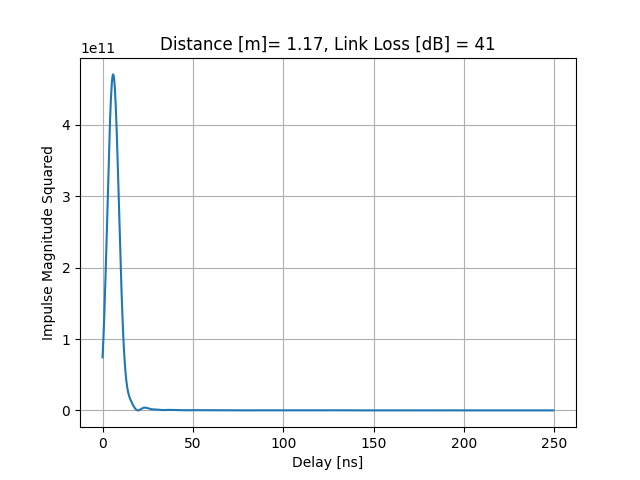
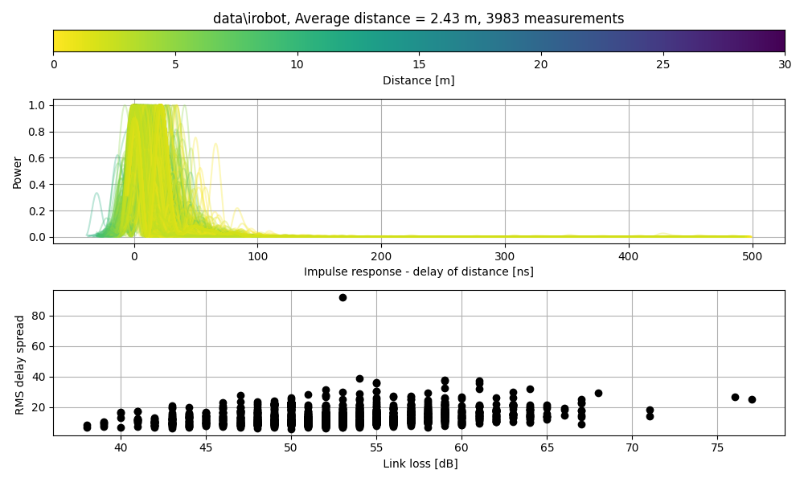

# Nordic distance toolbox example

## Background
Nordic has released [Nordic Distance Toolbox](https://github.com/nrfconnect/sdk-nrfxlib/tree/main/nrf_dm) and some sample apps in Nordic
Connect SDK.

Although it's possible to use the examples, I'm more of a barebone guy. With the
NDT, it's possible to get the I and Q tones from the multi-carrier phase
difference measurement, and thus, it's possible to play with them.

For example, estimating the impulse response between two devices 

    python3 py/plot.py impulse --com /dev/tty.usbmodem0006857014091



## Expected knowledge
This repository assume you know a few things, like
* git 
* C
* Python programming and how to get missing packages with python3 -m pip install <package>
* installing NRF Connect SDK
* Basics of communcation


## Getting started

You need [Nordic Connect
SDK](https://developer.nordicsemi.com/nRF_Connect_SDK/doc/latest/nrf/index.html)

- Via the nRF Connect for Desktop open the Toolchain manager
- Install latest NRF Connect SDK. This repo is tested with v2.1.0
- In the Toolchain Manager, open command prompt 
- In the command prompt, make sure the environment is loaded, for example `c:\ncs\v2.0.0\zephyr\zephyr-env.cmd`
- Try the steps below. If you don't have make, then you can look in the Makefile
for the commands, for example 
``` bash
    cd reflector
    west build -b nrf52833dk_nrf52833 -- -DCONF_FILE=prj.conf
```


Once everything is installed, then you should be able to do

    make first
    
    
And look in the Makefile for the rest


## How it works

The code is made for nRF52833DK, so you need two of those.

The reflector code (reflector/src/main.c) must be flashed to one kit
    
    make flashr

The initiator code (initiator/src/main.c) must be flashed to another kit

    make flashi
    
The initiator will wait for a character on UART (any character). Then,
it will execute a ranging procedure, and afterwards dump json version of the
`nrf_dm_report_t` to the terminal


``` json
{"i_local": [0, 0, 0, 0, -7319, -7313, 4926, -6128, -316, -6474, 7072, -4938, -6043, 6389, 6451, 1381, -43, 1325, -5936, 5771, -2543, 294, 1164, -2840, -2087, 1769, 5671, -721, 3287, 2414, 3323, -2681, 502, -3325, 4849, 4444, -4889, 401, -4510, -4476, 3529, -3800, -4655, -912, -2990, -1097, 103, 4481, 4393, 1313, 2873, -363, -2859, -3791, -3363, -3471, 4228, -3889, 3721, -1410, 2003, 3972, -1836, -4289, 4037, -4360, -2153, 4321, -4289, 1402, -3008, 3359, -1563, -4496, -4156, 3462, -4343, 4222, 4669, 0], "q_local": [0, 0, 0, 0, -364, -61, 5351, 3895, -7200, 3021, -467, -5019, -3498, 2597, -2164, 6584, -6651, 6433, 2540, 2679, -5738, 6155, -5974, 5254, -5507, 5512, 187, -5556, -4430, 4817, -4196, 4518, -5164, -3922, 1418, -2230, -715, -4866, -1788, -1699, -3170, -2773, 154, 4517, 3464, -4430, 4527, -75, 790, -4252, 3371, 4407, -3372, -2217, -2750, 2586, 945, -1886, 2135, -4063, -3829, 1589, -3897, 405, 1644, 232, 3838, 924, -1293, 4290, 3400, -3106, 4343, -1094, 2077, -3096, 1719, 2030, -728, 0], "i_remote": [0, 0, 0, 0, 5710, 5989, -7324, 3591, 3350, 5030, -6847, 5855, 6503, -6543, -6564, -464, -1542, 438, 6411, -4283, -300, 3063, -4365, 5485, -2258, 2487, -3862, -3738, -5358, 2812, -5129, 5100, -4618, -2281, -600, -3515, 853, -4604, -651, -749, -3645, -2250, 347, 4398, 3497, -4295, 4352, 430, 1171, -3933, 3643, 4112, -3764, -2842, -3281, 1332, 2355, -3110, 3499, -4108, -2476, 3362, -4141, -1953, 3553, -2523, 1715, 3466, -3766, 3917, -91, 1166, 993, -4326, -2630, 1970, -3471, 4563, 4217, 0], "q_remote": [0, 0, 0, 0, 5040, 4644, 1654, 6545, -6608, 5305, -2380, -4142, -2668, 2403, -2024, 6733, -6474, 6522, 296, 4674, -6221, 5276, -4122, 2141, -5334, 5117, 4011, -4005, -187, 4442, 762, -196, -2027, -4395, 4849, 3287, -4688, -1033, -4621, -4555, 2730, -3930, -4468, -576, -2671, -932, -1, 4328, 4128, 1713, 2240, -1044, -1951, -3124, -2609, -3957, 3450, -2756, 2266, 603, 3341, 2447, 338, -3732, 2254, -3444, -3951, 2590, -2201, -2038, -4478, 4345, -4428, -1417, -3742, 4171, -3030, -869, 1984, 0], "ifft[mm]": 1096, "phase_slope[mm]": 1522, "rssi_openspace[mm]": 501, "best[mm]": 1096, "link_loss[dB]": 34, "rssi_local[dB]": 27, "rssi_remote[dB]": 26, "txpwr_local[dB]": 8, "txpwr_remote[dB]": 8, "quality": 0}
```

The `py/plot.py` can read the JSON directly from device, or from file to produce plots.

    python3 py/plot.py impulse --com /dev/tty.usbmodem0006857014091

## Examples 

Collect some data. In the attached dataset I placed one DK on my Roomba iRobot,
and the other stationary, and let the collection run for a while

``` bash
python3 py/plot.py msave --com /dev/tty.usbmodem0006857014091 data/irobot --count 100
```

``` bash
python3 py/plot.py impulsedir data/irobot
```

All the data from that run is in `data/irobot`




## Support

Don't expect any, but at the same time, don't be afraid to ask.

## Changelog
- Fixed high_precision_calc 
- Updated to nRF Connect SDK v2.1.0
- Added hopping sequence 
- Added duration

## Known issues
- You need to set the `sid_refl` and `sid_init` in the Makefile to the correct ID's for your
  dev-kits 
- On windows I've seen problems with the common/src/dm.c . That's included with
  a symbolic link, and that does not always work on Windows. The solution is to
  copy the common/src/dm.c file to the reflector/src/ and initiator/src/ directory

## Wanted features
If you feel like it, fork and send pull requests. I would like the following
future features

### Support for multiple reflectors
Today the AA is hardcoded in initiator and reflector, however, it should be
possible to use the buttons on the DK to change the AA. One way to do it could
be
- On Reflector. On button press, increment the AA
- On Initiator. On button press, increment the number of AA's the initiator
  would loop through
  
### Low power reflector 
The reflector would be battery powered, right now it camps on a frequency and
waits for a packet from initiator. If it times out, it will restart the radio,
and camp again. This draws mA of current. 

One option would be to setup BLE advertizing on the reflectors with a low advertizing interval,
for example 4 seconds. The initiator could scan for advertiziers. Once it sees
an advertizer it could respond, and wake the reflector. The reflector could stay
on for maybe 10 seconds or more, to make sure that the inititator could do the
ranging. 

This is similar, but not the same, as is done in the
[nrf_dm](https://developer.nordicsemi.com/nRF_Connect_SDK/doc/2.0.0/nrf/samples/bluetooth/nrf_dm/README.html) example.

