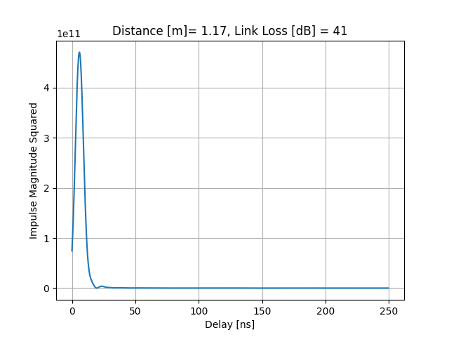
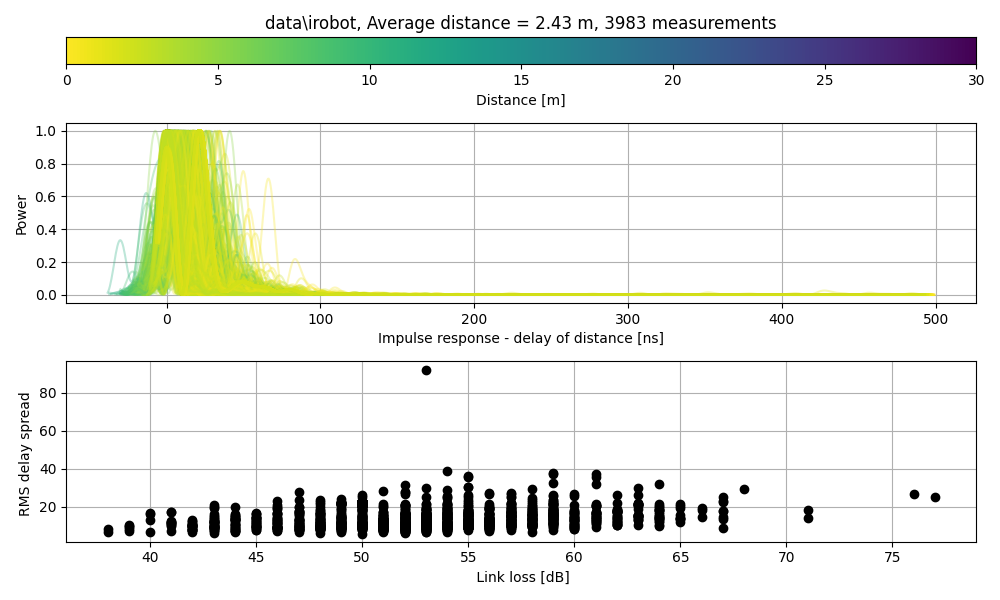

# Nordic distance toolbox example

## Background
Nordic has released [Nordic Distance Toolbox](https://github.com/nrfconnect/sdk-nrfxlib/tree/main/nrf_dm) and some sample apps in Nordic
Connect SDK.

Although it's possible to use the examples, I'm more of a barebone guy. With the
NDT, it's possible to get the I and Q tones from the multi-carrier phase
difference measurement, and thus, it's possible to play with them.

For example, estimating the impulse response between two devices 

    python3 py/plot.py impulse --com /dev/tty.usbmodem0006857014091



## Expected knowledge
This repository assume you know a few things, like
* git 
* C
* Python programming and how to get missing packages with python3 -m pip install <package>
* installing NRF Connect SDK
* Basics of communcation


## Getting started

You need [Nordic Connect
SDK](https://developer.nordicsemi.com/nRF_Connect_SDK/doc/latest/nrf/index.html)

- Via the nRF Connect for Desktop open the Toolchain manager
- Install NRF Connect SDK. This repo is tested with v2.1.0 and v3.3.0
- In the Toolchain Manager, open command prompt 
- In the command prompt, make sure the environment is loaded, for example `c:\ncs\v2.0.0\zephyr\zephyr-env.cmd`
- Set `sid_refl` and `sid_init` in the `Makefile` to your DK serial numbers (`nrfutil device list`)
- Install Python dependencies:

```bash
python3 -m pip install -r requirements.txt
```

If you don't have `make`, look in the `Makefile` for the underlying commands, for example:

```bash
cd reflector
west build -b nrf52833dk/nrf52833 -- -DCONF_FILE=prj.conf
```

Build and flash both kits:

```bash
make build flashr flashi
```

`make first` is an alias for `make build`.


## How it works

The code is made for nRF52833DK, so you need two of those.

The reflector code (reflector/src/main.c) must be flashed to one kit
    
    make flashr

The initiator code (initiator/src/main.c) must be flashed to another kit

    make flashi
    
The initiator waits for any character on UART, runs one ranging procedure, and
prints a JSON `nrf_dm_report_t` on the terminal (115200 baud).

The reflector runs continuously: each loop it calls `nrf_dm_proc_execute()` and
waits for the initiator sync packet. **Initiator and reflector use different
timeouts** — the reflector needs a longer window because it waits for the
initiator (see Nordic `nrf_dm_proc_execute()` docs). Defaults are in
`common/include/dm_timeout.h` and can be overridden at build time:

```bash
make build flashr flashi INITIATOR_TIMEOUT_US=50000 REFLECTOR_TIMEOUT_US=500000
```

Typical JSON fields (distances in mm in JSON, meters in `plot.py`):

| Field | Meaning |
|-------|---------|
| `ifft[mm]`, `best[mm]`, `phase_slope[mm]`, `highprec[mm]` | Distance estimates |
| `quality` | 0 = OK, higher = do not use |
| `timed_out` | 1 if initiator procedure timed out |
| `duration[us]` | On-air duration when successful |
| `timeout_initiator[us]`, `timeout_reflector[us]` | Configured timeouts |
| `i_local`, `q_local`, … | IQ tones |

`py/plot.py` reads JSON from the device or from files saved under `data/`.

```bash
python3 py/plot.py impulse --com /dev/tty.usbmodem0006857014091
```

### Collecting measurements (`msave`)

`msave` triggers the initiator over serial, prints an aligned table (via
[rich](https://github.com/Textualize/rich)), and saves good measurements as
`.json` files. **TIMEOUT** and **SYNC** rows are logged but not saved.
**WARN** rows (e.g. `highprec` far from `ifft`) are logged but not saved.

Recommended settings for stable collection (~75% success in practice):

```bash
python3 py/plot.py msave --com /dev/tty.usbmodem0006857014091 data/2026 \
  --count 100 --interval 0.3 --retry 3
```

| Option | Default | Purpose |
|--------|---------|---------|
| `--count` | 10 | Number of measurements to attempt |
| `--interval` | 0.1 | Seconds between UART triggers |
| `--retry` | 0 | Extra attempts on TIMEOUT/SYNC before logging the row |

Measurements often arrive in **bursts** (several OK rows, then timeouts) because
the host trigger must align with the reflector listen window. A longer
`--interval` and `--retry` help.

To sweep timeout values (rebuild + flash each pair):

```bash
python3 py/timeout_sweep.py --com /dev/tty.usbmodem0006857014091 --count 10
```

## Examples 

Collect some data. In the attached dataset I placed one DK on my Roomba iRobot,
and the other stationary, and let the collection run for a while:

```bash
python3 py/plot.py msave --com /dev/tty.usbmodem0006857014091 data/irobot \
  --count 100 --interval 0.3 --retry 3
```

Plot impulse responses from saved JSON:

```bash
python3 py/plot.py impulsedir data/irobot
```

All the data from that run is in `data/irobot`




## Support

Don't expect any, but at the same time, don't be afraid to ask.

## Changelog
- Fixed high_precision_calc 
- Updated to nRF Connect SDK v2.1.0
- Added hopping sequence 
- Added duration
- Updated to nRF Connect SDK v3.3.0
- Asymmetric initiator/reflector timeouts (`INITIATOR_TIMEOUT_US`, `REFLECTOR_TIMEOUT_US`)
- JSON: `timed_out`, `timeout_initiator[us]`, `timeout_reflector[us]`
- `msave`: rich table logging, status column (OK/TIMEOUT/SYNC/WARN), `--interval`, `--retry`
- `py/timeout_sweep.py` for timeout tuning
- `requirements.txt` for Python dependencies

## Known issues
- You need to set the `sid_refl` and `sid_init` in the Makefile to the correct ID's for your
  dev-kits 
- On windows I've seen problems with the common/src/dm.c . That's included with
  a symbolic link, and that does not always work on Windows. The solution is to
  copy the common/src/dm.c file to the reflector/src/ and initiator/src/ directory

## Wanted features
If you feel like it, fork and send pull requests. I would like the following
future features

### Support for multiple reflectors
Today the AA is hardcoded in initiator and reflector, however, it should be
possible to use the buttons on the DK to change the AA. One way to do it could
be
- On Reflector. On button press, increment the AA
- On Initiator. On button press, increment the number of AA's the initiator
  would loop through
  
### Low power reflector 
The reflector would be battery powered, right now it camps on a frequency and
waits for a packet from initiator. If it times out, it will restart the radio,
and camp again. This draws mA of current. 

One option would be to setup BLE advertizing on the reflectors with a low advertizing interval,
for example 4 seconds. The initiator could scan for advertiziers. Once it sees
an advertizer it could respond, and wake the reflector. The reflector could stay
on for maybe 10 seconds or more, to make sure that the inititator could do the
ranging. 

This is similar, but not the same, as is done in the
[nrf_dm](https://developer.nordicsemi.com/nRF_Connect_SDK/doc/2.0.0/nrf/samples/bluetooth/nrf_dm/README.html) example.

